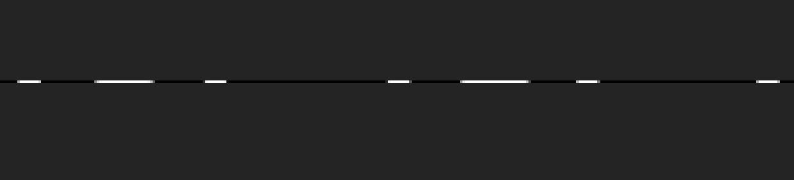

# Broken image

The image we receive is 179200 pixels in width, but only 1 in height. When we look closer, we can see that the image is black with white stripes.



The spaces between groups of stripes incidate that these might be letters that were chopped op horizontally into stripes 1 pixel in height. We need to reverse the process in order to see the original text, which most likely will be the flag.

We have a hint, that "the key is 140", so we can assume, that the image was once 140 pixels in height. Now we loop over all the pixels in the image, creating a new row every 140. For this, you can use the Pillow Python package for example. Here is the script:

```py
from PIL import Image

original = Image.open("image.png")
h = 140 # the "key" or original height of the image
w = original.width // h

new = Image.new(mode="RGB", size=(original.width // h, h))

x = 0
y = 0
for p in range(original.width):
    if y == h: # every 140 pixels, we create a new row
        x += 1
        y = 0
    new.putpixel((x, y), original.getpixel((p, 0)))
    y += 1

new.save("new.png")
```
We can now open the image and read the flag written as large, white text on a black background.

