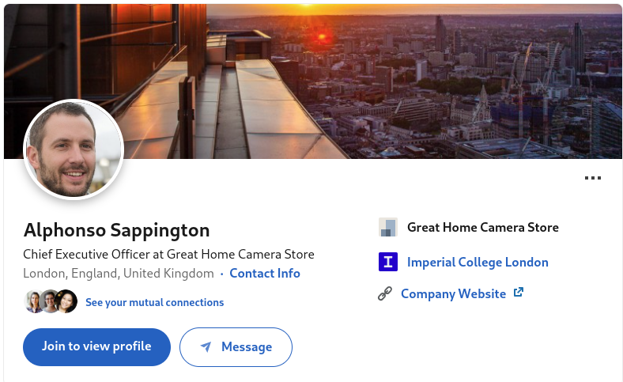
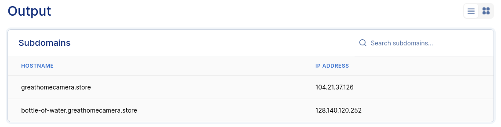

# Alphonso - Writeup

**Note: The social media accounts, website  and RTMP server used for this challenge will be deleted after the event.**

We have to find information about Alphonso Sappington and his home security camera business. A good place to start would be the company's website.

As the target is a businessman, a good place to look for would be LinkedIn, which allows you to search for users [by name](https://www.linkedin.com/pub/dir/+/+?trk=guest_homepage-basic_guest_nav_menu_people).

And indeed, we found his profile:

From here, we get the link to the company website: https://greathomecamera.store

(it could also be found on [X/Twitter](https://twitter.com/AlphonsoSa75779))

The website is also indexed in Google.

We inspect the website, and in the FAQ section, we find some interesting information:

*Our mobile app allows you to view live video feeds from your cameras, just type in your URL with a unique subdomain which your received upon buying, followed by /live, for example: `yellow-elephant.greathomecamera.store/live` and the app will connect to the camera using the RTMP protocol from anywhere in the world!*

[RTMP (Real Time Message Protocol)](https://en.wikipedia.org/wiki/Real-Time_Messaging_Protocol) is a protocol allows you to view webcam streams in real time and by default doesn't require any authentication.

So, our task now will be to find the correct subdomain to view the stream, in other words, we have to enumerate all the subdomains.

There are many tools for this, among them online tools such as [this one at pentest-tools.com](https://pentest-tools.com/information-gathering/find-subdomains-of-domain) or [subdomainfinder.io](https://subdomainfinder.io/). In this example, we will use the first one. We enter the domain and wait for the results:

The only subdomain is `bottle-of-water.greathomecamera.store`.

Upon connecting over RTMP (using a client, e. g. VLC Media Player) and entering the URI:

`rtmp://bottle-of-water.greathomecamera.store/live`

The player can view a video stream where the flag is visible.