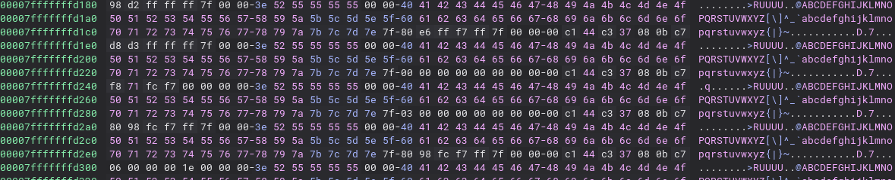

# Solution

The binary initializes stack for `check_flag` function that will be called in the future with `__attribute__((constructor))` function.  
The `check_flag` function does not initialize value of `tab` instead it reuses value that are already there.  
the stack:  


## A
1. Find global lookup table
2. add to each integer 0x40
3. convert integers to chars
4. concatenate chars

## B


```c
//Decompiled by binary ninja and cleaned up
uint64_t sub_11fa(char *arg1, int32_t arg2)
{
  char tab[0x40]
  uint64_t rbx
  rbx.b = *arg1 == tab[data_4020[arg2])]
  if (data_4020[arg2 + 1] != 0)
  {
    rbx = rbx.d & sub_11fa(&arg1[1])
  }
  return rbx.d
}
```
1. set breakpoint after `tab[data_4020[arg2])]`  
2. values resulting from the lookup in subsequent calls are the flag