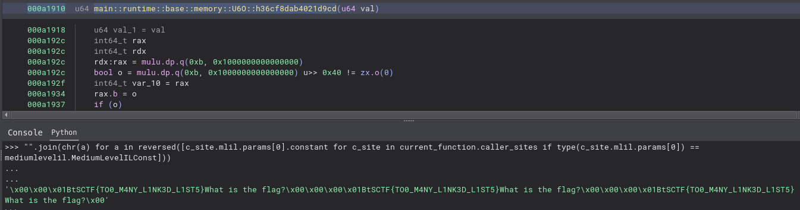

# Write-up

The program was compiled using [hvm](https://higherorderco.com/) v1.0.11.

HVM stores strings as linked lists of unsigned 60 bit integers.

You can verify this be compiling your own hvm program to rust:
```rust
#[inline(always)]
pub fn _Main__apply(ctx: ReduceCtx) -> bool {
  if true {
    inc_cost(ctx.heap, ctx.tid);
    let ctr_0 = get_loc(ctx.term, 0)/*reuse:0*/;
    let ctr_1 = alloc(ctx.heap, ctx.tid, 2);
    link(ctx.heap, ctr_1 + 0, U6O(63));
    link(ctx.heap, ctr_1 + 1, Ctr(_String_nil_, ctr_0));
    let ctr_2 = alloc(ctx.heap, ctx.tid, 2);
    link(ctx.heap, ctr_2 + 0, U6O(103));
    link(ctx.heap, ctr_2 + 1, Ctr(_String_cons_, ctr_1));
    let ctr_3 = alloc(ctx.heap, ctx.tid, 2);
    link(ctx.heap, ctr_3 + 0, U6O(97));
    link(ctx.heap, ctr_3 + 1, Ctr(_String_cons_, ctr_2));
    let ctr_4 = alloc(ctx.heap, ctx.tid, 2);
    link(ctx.heap, ctr_4 + 0, U6O(108));
    link(ctx.heap, ctr_4 + 1, Ctr(_String_cons_, ctr_3));
    let ctr_5 = alloc(ctx.heap, ctx.tid, 2);
    link(ctx.heap, ctr_5 + 0, U6O(102));
    ...
```


## Solution (with Binary Ninja)

1. Find and click on "main::runtime::base::memory::U6O::h36cf8dab4021d9cd" (important! this will update `current_function` variable)
2. Run `[c_site for c_site in current_function.caller_sites]` to find all call sites of U60 function
3. To find all call sites where constant is passed as 1st argument run:
```python
[c_site for c_site in current_function.caller_sites if type(c_site.mlil.params[0]) == mediumlevelil.MediumLevelILConst]
```
4. To find all constants passed to U60 function run:
```python
[c_site.mlil.params[0].constant for c_site in current_function.caller_sites if type(c_site.mlil.params[0]) == mediumlevelil.MediumLevelILConst]
```
5. To convert constants to string run:
```python
constants = [c_site.mlil.params[0].constant for c_site in current_function.caller_sites if type(c_site.mlil.params[0]) == mediumlevelil.MediumLevelILConst]
"".join(chr(a) for a in reversed(constants))
```


## Troubleshooting
```
  File "/home/user/.local/share/binaryninja/plugins/../python/binaryninja/function.py", line 1311, in llil
    raise ILException(f"Low level IL was not loaded for {self!r}")
binaryninja.exceptions.ILException: Low level IL was not loaded for <func: x86_64@0x10f570>
```

Double click on `<func: x86_64@0x10f570>` to go to the function.
Click force analysis.