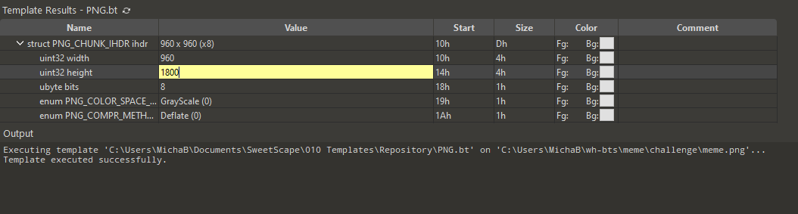
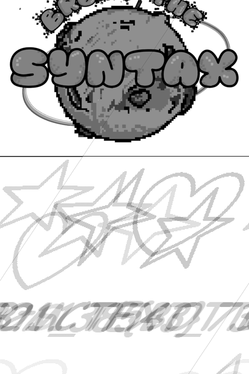
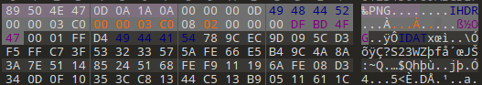
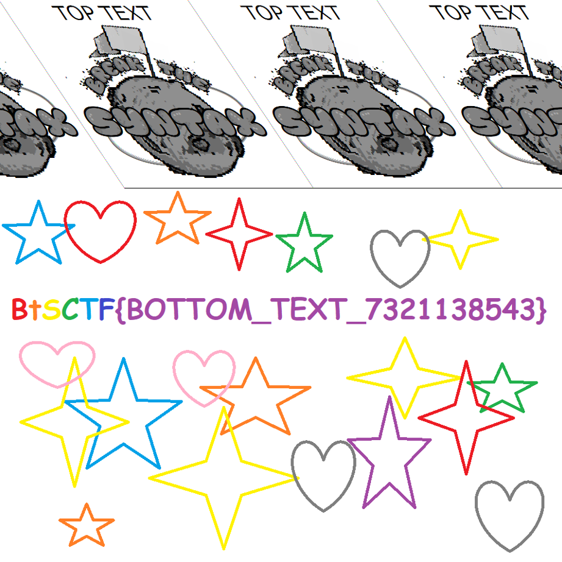

## meme - writeup

Upon initial analysis, it is likely that you will not find anything leading you to the flag - there is no LSB encoded data, the file is completely stripped of EXIF data, and there is nothing appended to the file. One thing you could do though, is to try to resize the image - there is a possibility that data was appended to the IDAT chunk present in the image.

You will quickly find that this is the case:

You can clearly see the flag at the bottom, but the hidden part of the image is weirdly squashed and appears to have white gaps between pixels. This is caused by the color type of the image - its is in grayscale. If the bottom part happened to be encoded in RGB it would be squashed and distorted due to parts of the pixels being interpreted as full pixels.

Change resolution back to normal and change color type to 2 (24 bit RGB):

You can see the flag now:

Additional notes:
- The black line that you see in the grayscale picture is composed of filter bytes that will align correctly with the scanlines once the color type is changed to 2. Since I made that file from scratch, I used filter 0 for every scanline (that's why its black). You can read more about the PNG file structure in [wikipedia](https://en.wikipedia.org/wiki/PNG)
- The PNG image render I used for this writeup is MS Paint. I found that it has a very lenient parser - for example, it does not verify checksums of the chunks. If you are using a different program to view images, you may need to fix the CRC checksum every time you modify contents of any chunk